# Compte Rendu Activité Pratique N°2 : Développement d'un micro service

## 1ère étape : 
Création d'un projet Spring Boot avec les dépendances Web, Spring Data JPA, H2, Lombok en utilisant Spring Initializr.

## 2ème étape : 
Création de l'entité JPA "Compte".
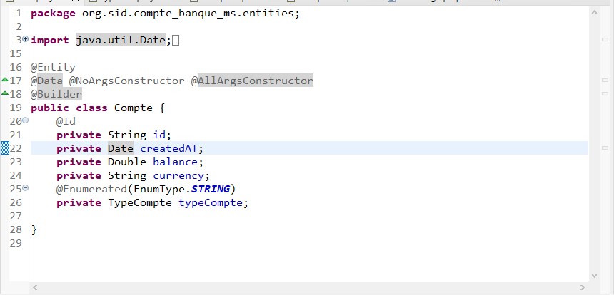

## 3ème étape :
Création de l'interface `CompteRepository`.
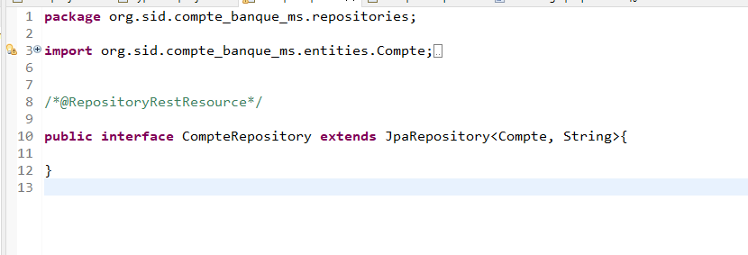

## 4ème étape - Test :
Accéder à la base de données via le lien configuré dans le fichier `.properties`.
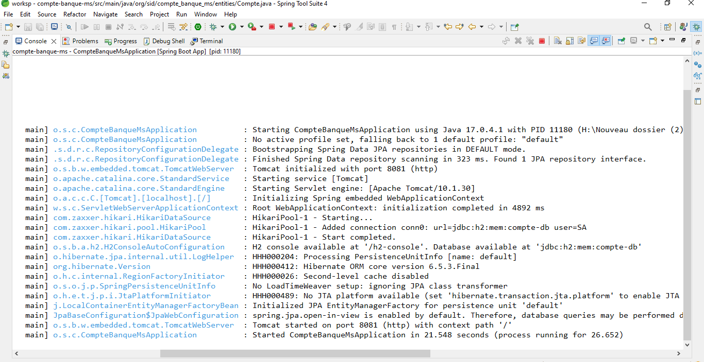
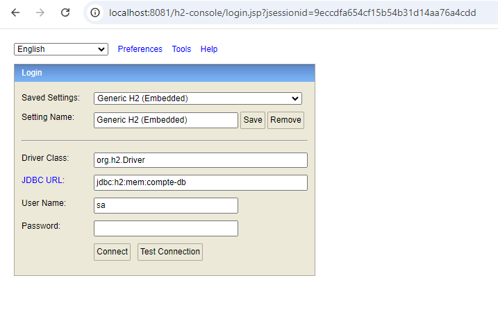
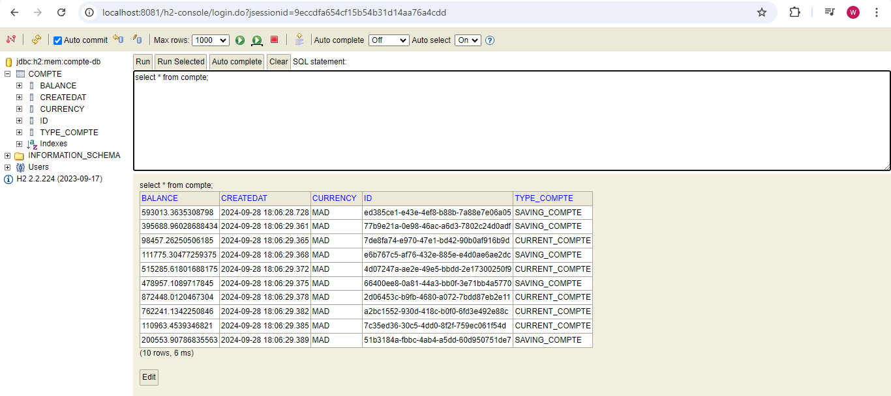

## 5ème étape :
Création du Web Service Rest qui permet de gérer des Comptes.
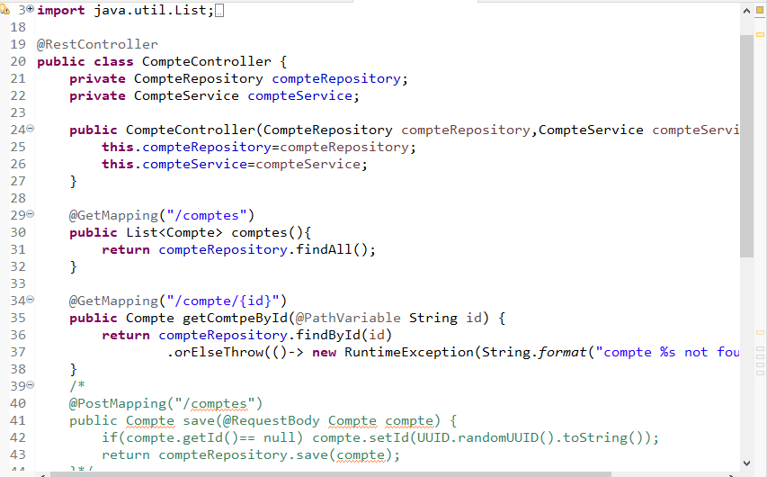

## 6ème étape - Test des API :
Tester le micro-service en utilisant un client REST comme Postman.
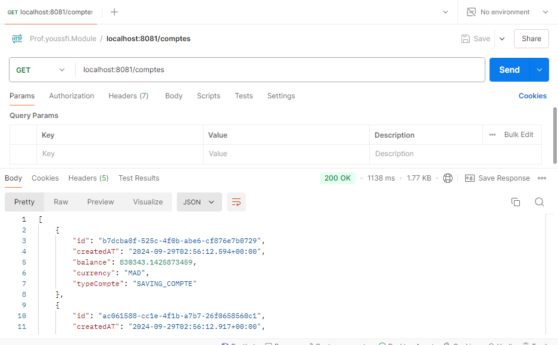
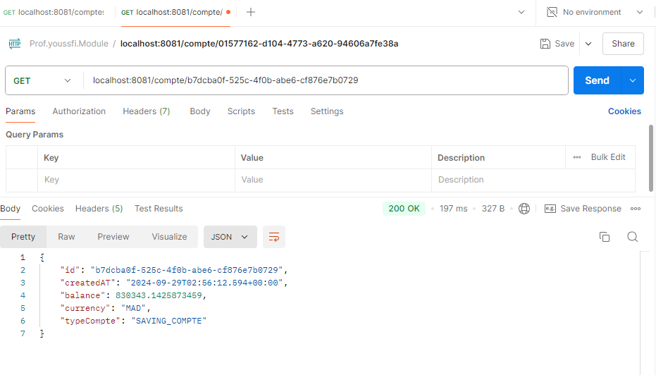

## 7ème étape :
Documentation Swagger.
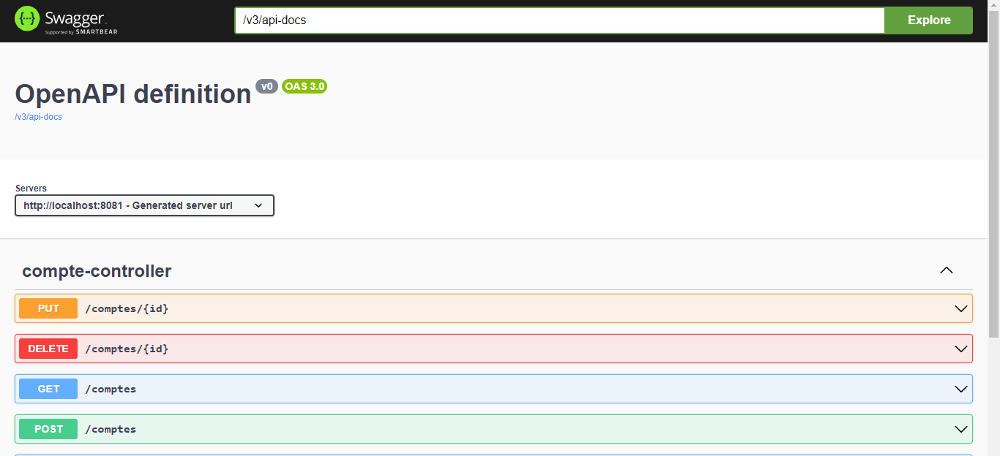

## 8ème étape :
Utilisation de Spring Data Rest en exploitant des projections.
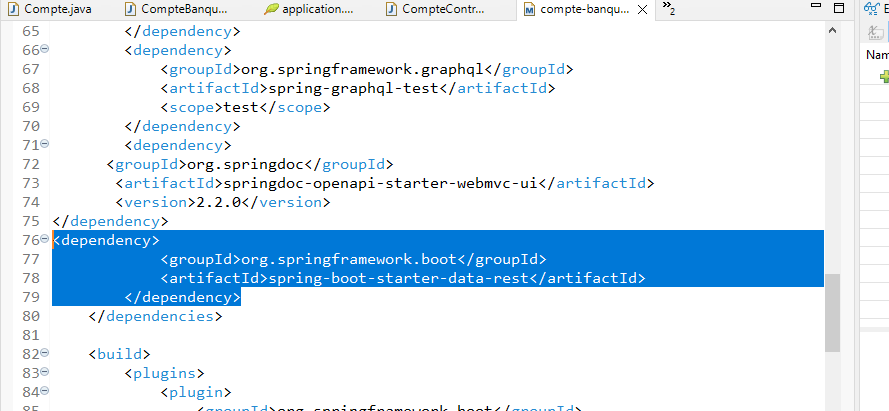
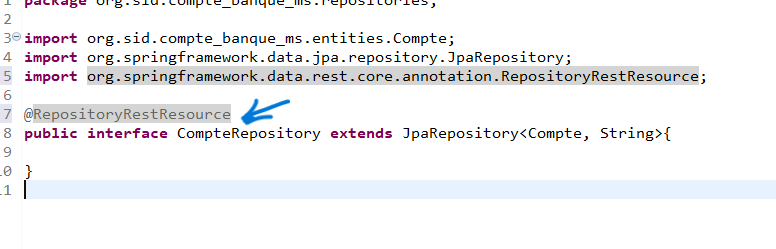
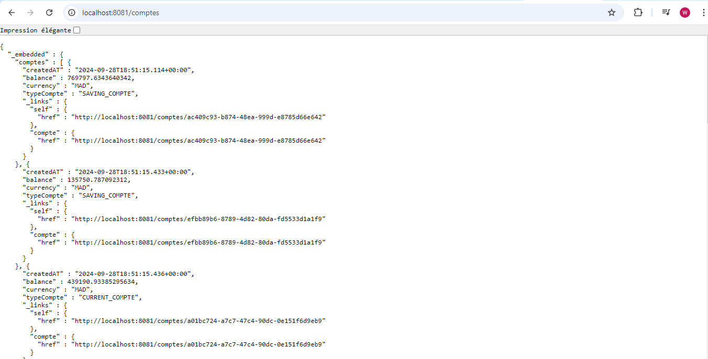

## 9ème étape :
Création des DTO, Mappers et la couche service.
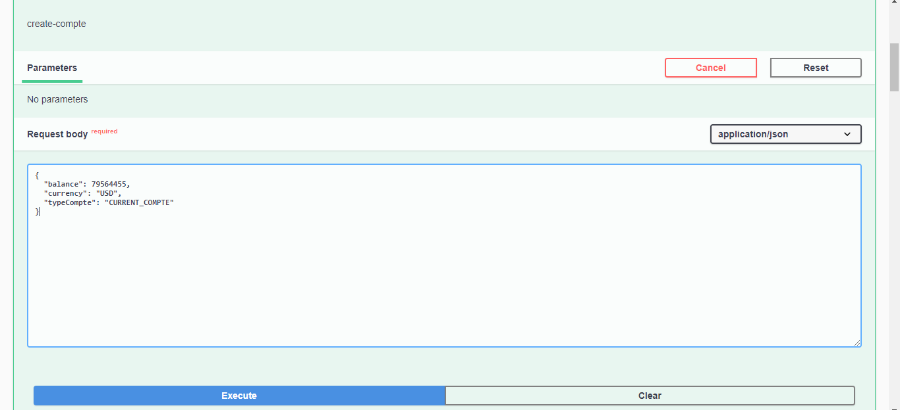
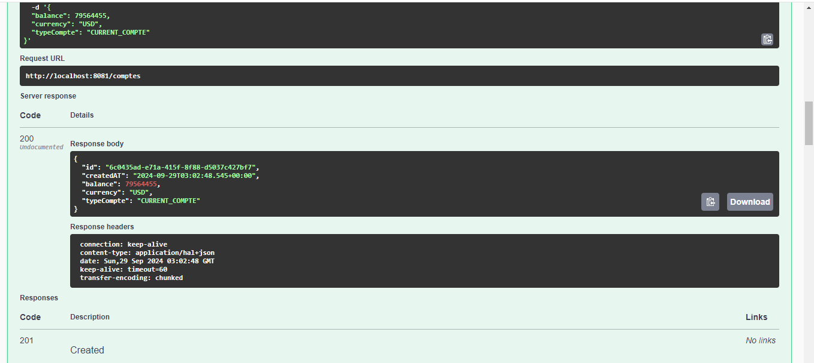

## 10ème étape :
Création d'un web service GraphQL.
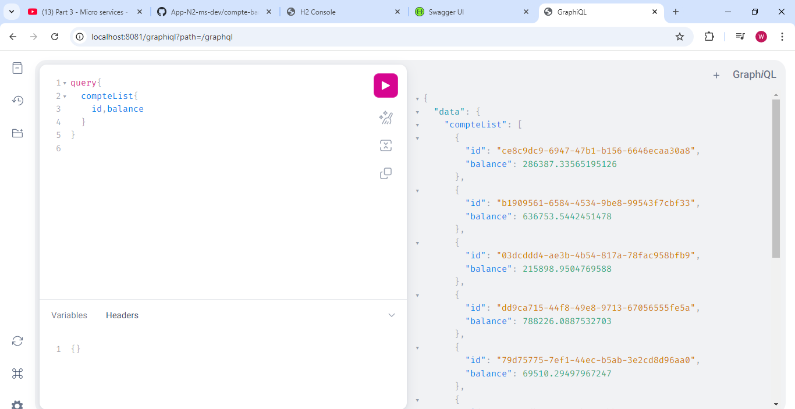
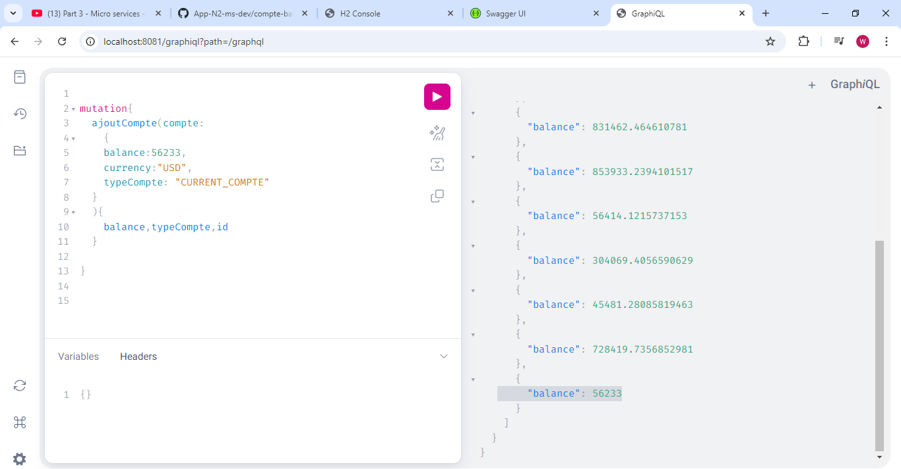
